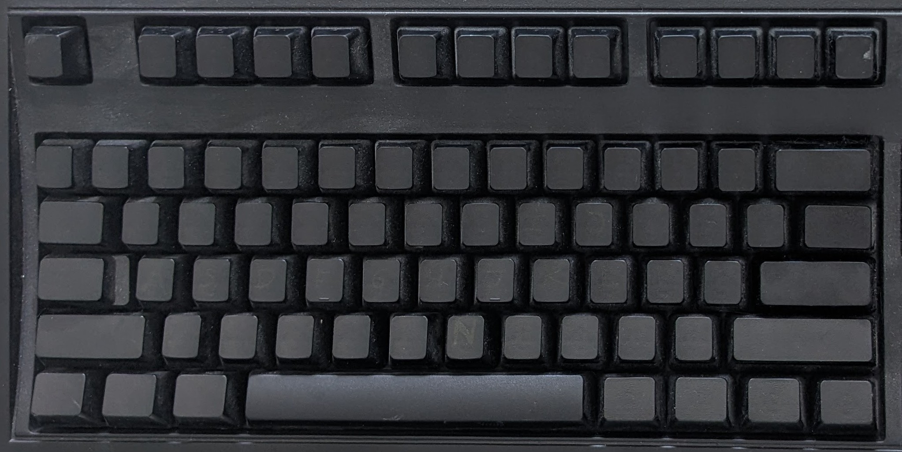

You've stumbled onto a few of my notes about interfaces. Some of them go back decades, and some spring from my Twitter/X feed. Even when the particulars change, the lessons often still apply.

Note: "Interface" here means any way you interact with systems or devices, from a steering wheel to a store checkout line; from a crisply written manual to a voice-driven menu where no option quite fits.

---

Explore by category:

* [**All things macOS**](./thoughts-macos.md) – "It just works" -- until it doesn't.
* [**Free & Open Source**](./thoughts-free-software.md) – Usability notes on community-driven software.
* [**Hardware & Physical UX**](./thoughts-hardware.md) – Atoms matter, not just bits.
* [**Search & Discovery**](./thoughts-search.md) – How we find or overlook information.
* [**Mobile Experience**](./thoughts-mobile.md) – Not everything that comes in small packages is good. 
* [**User Kindness**](./thoughts-kindness.md) – Avoiding hostility is a good start.
* [**Miscellany**](./thoughts-miscellany.md) - Overflow parking for ideas.  

---

