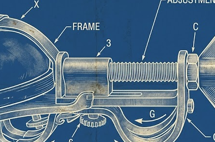

::: thought-box

### appply night

cappy apple-y
 apply abbple bapple. Some Adsam Smiths

The use of metals in this rude state was attended with two very considerable inconveniencies; first with the trouble of weighing;*67 and, secondly, with that*68 of assaying them. In the precious metals, where a small difference in the quantity makes a great difference in the value, even the business of weighing, with proper exactness, requires at least very accurate weights and scales. The weighing of gold in particular is an operation of some nicety. In the coarser metals, indeed, where a small error would be of little consequence, less accuracy would, no doubt, be necessary. 

Yet we should find it excessively troublesome, if every time a poor man had occasion either to buy or sell a farthing’s worth of goods, he was obliged to weigh the farthing. The operation 
of assaying is still more difficult, still more tedious, and, unless a part of the metal is fairly melted in the crucible, with proper dissolvents, any conclusion that can be drawn from it, is extremely uncertain. Before the institution of coined money, however, unless they went through this tedious and difficult operation, people must always have been liable to the grosses

[← Back to Index](index.html){.back-link}

:::

# apple.md Thoughts

