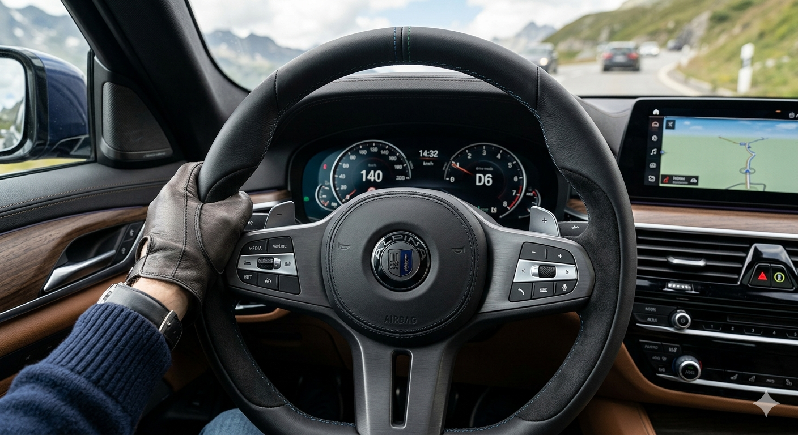

---

### Get the weight right — and lighter isn't always better

When it comes to hardware, don't assume heavy is bad. Sometimes "heavy" isn't quite the right word, really -- think solid, weighty, steady, reassuring.  

There's a reason that some people -- a dedicated cult, but a persistent one -- like keyboards that weigh more than a large cup of coffee. Or steering wheels that move smoothly, but take a bit of effort to turn. Twist the weighted knob on a classic stereo: it's the opposite of twitchy. There's no <i>strain</i> to use it, and there's also no way to accidentally swing it from zero to eleven -- it makes setting the right level deliberate, exact, and satisfying.  

  <a href="index.html">← Return to main page</a>

  <a href="index.html">← Return to main page</a>

### Out with the new, in with the old (sometimes!)

Web Designers: When you get your new development machine and larger, denser monitor, please keep your old hardware. By that I mean keep it <i>running<i> -- just like it is today. Same processor, same amount of RAM, same graphics card, same monitor. And this may seem painful, but it's the most important: The same browser.  

If you're like a lot of people in tech, the machine you consider obsolete is still a lot more powerful than many of the ones your work will be viewed on. And it will be next year, too, and the year after that. People -- maybe even your parents -- will have browsers that weren't updated yesterday, or last week, or last year. 
 
Trot that old system out occasionally to test your designs. Do animations work as you'd expect? Does the browser that you used three years ago still render things correctly? If your newer site breaks on the old machine, does it do so politely, or messily?

Even if you know your target audience won't be on machines like the ones you should keep stashed in your closet, designing conservatively will help your new stuff fly on newer hardware.

  <a href="index.html">← Return to main page</a>

