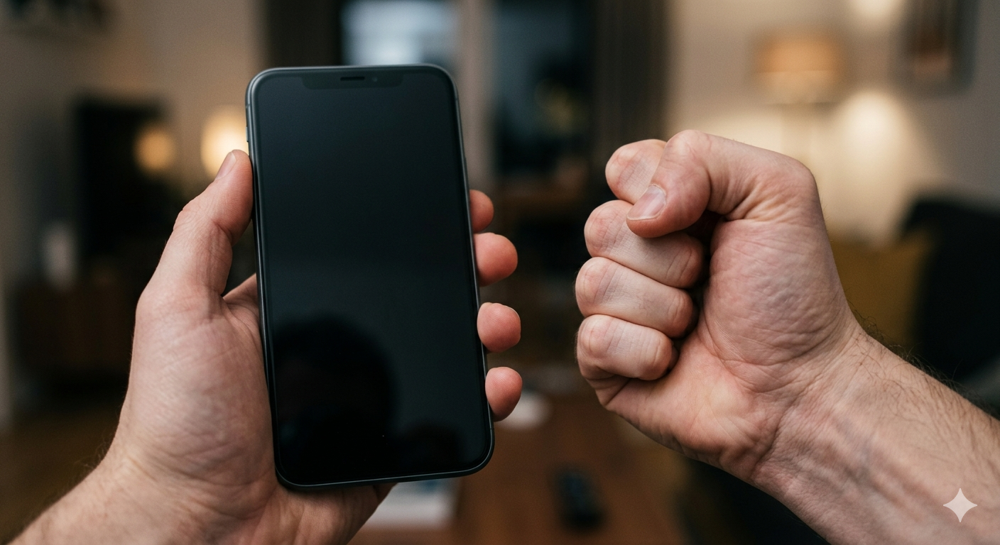

---

### Brightness control as a one-way transform

(<a href="https://x.com/timothylord/status/623568119877926912">Related tweet of 2015-07-21</a>)

There are times a fully-blank screen is good -- it saves battery, it's unobtrusive in a dark place, it doesn't call attention to itself generally. But in a brightly lit area, even a screen that's merely dim can be hard to see at all. If it's locked, it's hard to enter a PIN. Even if it's not, it's annoying bordering on impossible, a real recursive imp of a problem. It's hard to see the brightness controls themselves in order to fix the problem.
A glitch of this kind drove me batty a few months ago, and I had to blindly mash the position of the number keys until I got the PIN right.

**The fix** 

Employ the phone's physical buttons, or add a button / toggle for this purpose. Or use a squeeze sensor to smoothly, temporarily raise the screen brightness. On Pixel phones (Pixel 6 and newer), Power + Volume Up by default activates the Power controls menu; if that would also force increased brightness the problem is basically solved. Those Power controls are pretty useless if you can't see the screen.

To fix the problem even more? Give access to the Brightness slider control on that same Power controls view; it seems to add a big benefit, with little evident security or usability downside.

  <a href="index.html">← Return to main page</a>

### Keep the swiping keyboard small

(<a href="https://x.com/timothylord/status/623917393861959680">Related tweet of 2015-06-22</a>)

Swiping keyboards are great. So are adequately large, nicely legible on-screen interface elements. But typing-by-swiping is best and fastest when the keyboard itself is kept as small as a user wants it -- it's the shape the finger makes that matters. A bigger keyboard just means a longer, slower path. 

So if a phone or tablet rotates and the keyboard expands to fit that larger space, it's actually a loss to the user. (Not to mention, covers up more screen real estate.)

**The fix** 

Even if it's a large tablet, rather than a tiny phone, at least give the option of a finger-friendly, swiping keyboard, the same size as one on the phone

 - search for "Swype / swyping keyboards should be small."

  <a href="index.html">← Return to main page</a>

